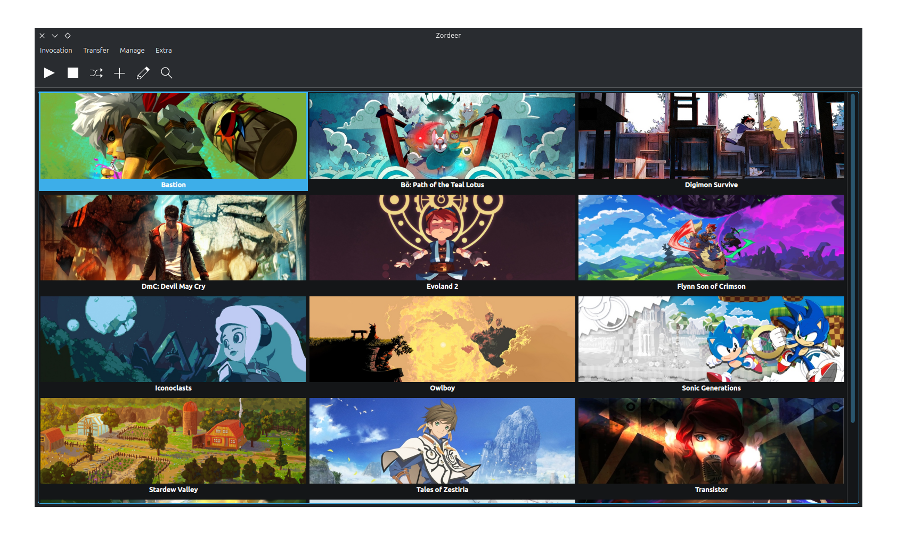

<h1 align="center">

   
  Zordeer
</h1>

  A Qt launcher for running games via Wine/Proton/UMU 

## Some explanations
- Why does the Zordeer exist?
  - I wanted a simple Qt launcher, without QML, that would work on Snapd.
- Why does Zordeer create the `$HOME/App/Zordeer` folder?
  - I wanted to use a non-hidden folder for the Zordeer and UMU files.
  - Zordeer also uses the `App/Zordeer` pattern to automatically correct saved paths.
- Is it possible to change the location of the `App/Zordeer` folder?
  - It's possible to use the `ZORDEER_HOME_DIR` environment variable to specify a path.
  - The Flatpak version uses the XDG Base Directory by default, but the `ZORDEER_HOME_DIR` environment variable overrides this.
  - In the Snap version, the `$SNAP_USER_COMMON` folder is used when the home plug is disconnected.
- Where will the UMU used by Zordeer transfer `steamrt3` to?
  - Zordeer uses the `UMU_FOLDERS_PATH` environment variable to change the path that UMU will use; you will find a folder called `UMU` next to the Zordeer folder.
- Regarding the paths like `/run/user/1000/doc/`
  - If this is seen in the `Shortcut manager` after selecting the folders, it's not a problem. But if it appears when selecting an executable or folder, this may prevent execution.
- About the toolbar
  - It is possible to hide the toolbar and use the context menu by right-clicking on the menu bar and unchecking the checkbox that appears.
