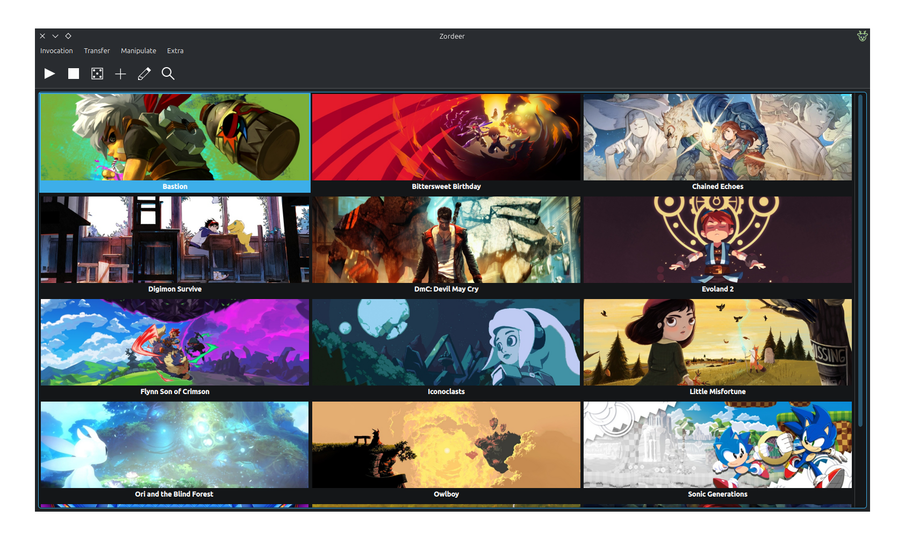

<h1 align="center">

   
  Zordeer
</h1>

  A Qt launcher for games that run via Wine/Proton, with support for the UMU launcher.

## Some explanations
- Why does the Zordeer exist?
  - I wanted a launcher for games that run via Wine/Proton. It needed to be simple, use Qt without QML, and work on Snapd.
- Why does Zordeer create the `$HOME/App/Zordeer` folder?
  - This was done so that Zordeer files wouldn't be hidden and scattered in various locations. Zordeer also uses the App/Zordeer standard to correct the paths used, to prevent files from not being found if the user wants the App/Zordeer folder in a different location.
- Is it possible to change the location of the `App/Zordeer` folder?
  - It's possible to use the `ZORDEER_HOME_DIR` environment variable to specify a path.
  - In the Snap version, the `$SNAP_USER_COMMON` folder is used when the home plug is disconnected.
- Regarding the paths like `/run/user/1000/doc/`
  - If this is seen in the `Shortcut manager` after selecting the folders, it's not a problem; it means that Document Portal is being used.